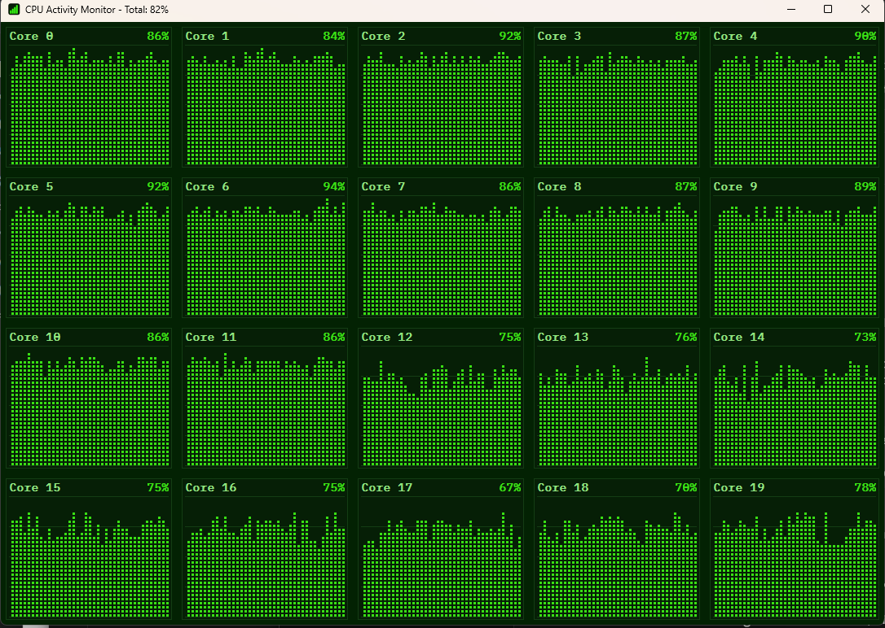

# CPU Activity Monitor

[](https://github.com/607011/ActivityMonitor/actions/workflows/ci.yml)
[](https://github.com/607011/ActivityMonitor/actions/workflows/release.yml)

[](LICENSE)

A lightweight native Windows app (C++17, Win32/GDI) that shows CPU usage per
logical core as a scrolling bar-chart history. Readings come from the
Performance Data Helper (PDH) API; rendering is done with GDI (double
buffered via a memory DC, no flicker). The whole thing compiles down to a
single `ActivityMonitor.exe` under **48 KiB** - no runtime DLLs beyond the
standard Windows system libraries - and CI fails the build if that ever
regresses (see [`.github/workflows/ci.yml`](.github/workflows/ci.yml)).



## Download

Prebuilt binaries are published on the [Releases page](https://github.com/607011/ActivityMonitor/releases)
for every version tag (`vX.Y.Z`), as a zip containing `ActivityMonitor.exe`
plus a `.sha256` checksum file. See [Continuous integration](#continuous-integration)
below for how these are built.

> [!CAUTION]
> **`ActivityMonitor.exe` is not code-signed**, so Windows will show a
> "Windows protected your PC" / Microsoft Defender SmartScreen warning the
> first time you run it on another machine. This is expected for a small,
> unsigned freeware tool - not a sign of tampering. Verify the download's
> integrity with the `.sha256` file if you want to be sure, then click
> **More info -> Run anyway** to start it. A proper code-signing
> certificate (or a free one via [SignPath Foundation](https://signpath.org/))
> is more than this project currently justifies, given it has no
> significant user base yet.

## How it works

- **`CpuMonitor`** (`src/CpuMonitor.h/.cpp`) opens one PDH counter per
  logical core (`\Processor(N)\% Processor Time`) plus one for `_Total`,
  and collects a new sample once per second. The last 300 values per core
  (5 minutes at 1 Hz) are kept in a ring buffer.
- **`GraphWindow`** (`src/GraphWindow.h/.cpp`) is the main window. It lays
  out the cores automatically in a roughly square grid and draws one panel
  per core with a title, the current percentage, gridlines (0/25/50/75/100%),
  and the usage history as a bar chart. Bars have a fixed pixel width and
  gap regardless of panel size - resizing the window changes how many bars
  fit, never how wide they are - and each bar is filled with a tiled
  "segment" pattern brush so it renders as a stack of discrete lit blocks
  (LED-matrix style) instead of a solid area. Everything is drawn into an
  offscreen bitmap (memory DC) and only then blitted to the screen via
  `BitBlt`.
- The title bar additionally shows the current overall CPU usage.
- The color theme is light green on dark green (`kBarColor` /
  `kBackgroundColor` / `kPanelBgColor` in `GraphWindow.cpp`).
- Panel titles and percentages use a monospaced, "technical"-looking font.
  `GraphWindow::CreateMonospaceFont` tries a list of candidates in order
  (IBM Plex Mono, Cascadia Mono, Consolas, Courier New) and picks the first
  one actually installed on the system - install IBM Plex Mono for the
  intended look, otherwise it falls back gracefully.
- The app icon (`app.ico`, a small bar-chart glyph matching the on-screen
  theme) is generated by `tools/make_icon.ps1`.
- A **system tray icon** shows a live gauge of the overall (all-core average)
  CPU usage, redrawn every second in the same light-green-on-dark-green
  style. Closing the window (or minimizing it) hides it to the tray instead
  of exiting; left-click the tray icon to bring the window back, right-click
  for a "Show" / "Exit" menu.

## Build

Prerequisite: Visual Studio (with "Desktop development with C++") or the
Build Tools, plus CMake >= 3.16.

From an **"x64 Native Tools Command Prompt for VS"** (or any PowerShell/shell
that has `cl.exe` on `PATH`):

```bash
cmake -S . -B build -G "Visual Studio 17 2022" -A x64
cmake --build build --config Release
```

The resulting `ActivityMonitor.exe` ends up in `build/Release/`.

Or with Ninja:

```bash
cmake -S . -B build -G Ninja -DCMAKE_BUILD_TYPE=Release
cmake --build build
```

MinGW-w64 also works (pdh/gdi32/user32/comctl32 are linked via
`target_link_libraries`):

```bash
cmake -S . -B build -G "MinGW Makefiles"
cmake --build build
```

## Continuous integration

Two GitHub Actions workflows live in `.github/workflows/`:

- **[`ci.yml`](.github/workflows/ci.yml)** runs on every push and pull
  request against `main`: configures and builds a Release binary on
  `windows-latest`, fails the build if `ActivityMonitor.exe` exceeds the
  48 KiB size budget, and uploads it as a build artifact for inspection.
- **[`release.yml`](.github/workflows/release.yml)** runs only when a tag
  matching `vX.Y.Z` (e.g. `v1.0.0`) is pushed. It builds a Release binary
  with that version baked into the executable's file properties (see
  `src/version.h.in` / `src/resource.rc`), re-checks the size budget, zips
  the exe together with the README, computes a SHA-256 checksum, and
  publishes both as a GitHub Release with auto-generated release notes.

To cut a release:

```bash
git tag v1.0.0
git push origin v1.0.0
```

## Customization

- Update interval: `GraphWindow::kUpdateIntervalMs` (default 1000 ms).
- History length: `CpuMonitor::kHistoryLength` (default 300 samples).
- Bar size: `kBarWidth` / `kBarGap` in `GraphWindow.cpp` (fixed pixel size,
  independent of window size).
- Segment size: `kSegmentLitHeight` / `kSegmentGapHeight` in
  `GraphWindow.cpp`.
- Colors: `kBarColor`, `kBackgroundColor`, `kPanelBgColor`, `kGridColor`,
  `kTextColor`, `kMutedTextColor` in `GraphWindow.cpp`.
- Font candidates: the list in `GraphWindow::CreateMonospaceFont`.

## License

MIT - see [LICENSE](LICENSE).
